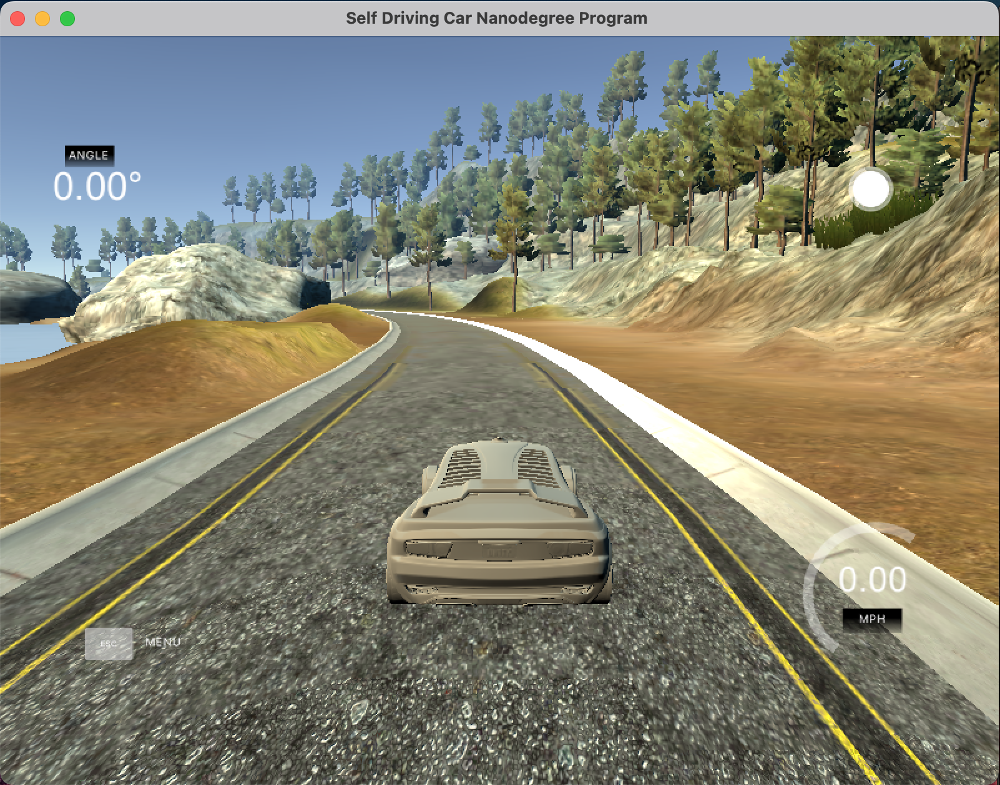

# ISY-503-A3-Computer-Vision

Assessment 3 Project for ISY-503 Intelligent Systems subject.

## Overview
Tasked of building a machine learning model that is trained on the data provided and when run on the simulator, will hopefully keep the car on the road without running off track. 



## Implementation
The project was divided into two phases: 
### Model implementation
The standalone model was developed in this [Google Colab notebook](https://colab.research.google.com/drive/1Tcw6vkwvnkPCiZ0Fez2rJDkdzIu5oQy5#scrollTo=9QR59YgWRi1P). All the necessary steps were included to develop the model, like:
* Loading of dataset
* Splitting to training, testing, and validation datasets
* Normalisation and preprocessing of dataset
* Model compilation
* Model training
* Model evaluation
* Prediction

In addition, visualisations were included across various stages of the notebook to better illustrate and debug the performance of the model.

The model itself was heavily based on existing articles tackling the Udacity Self-Driving Car Simulator exercises, mainly:
* [naokishibuya/car-behavioral-cloning](https://github.com/naokishibuya/car-behavioral-cloning/tree/master)
* [Self Driving Car using Tensorflow](https://dipankarmedhi.hashnode.dev/self-driving-car-using-tensorflow)

### Integration with simulator
The simulator used for this project was the *Version 1 (12/09/16)* file from [Udacity self-driving-car-sim](https://github.com/udacity/self-driving-car-sim?tab=readme-ov-file) repository.

Once downloaded, next is the setting up of the environment byfollowing the quick start guided provided by [naokishibuya](https://github.com/naokishibuya/car-behavioral-cloning/tree/master).

With the generated `model.h5` file from the notebook, the `drive.py` script provided by the simulator files is then executed to connect with the simulator. The simulator is then run in *Autonomous* mode to test the model with the selected track. This is done by running the command in your terminal:
```
python drive.py model.h5
```

## Challenges
Some of the challenges encountered were:
* Model yielded decent accuracy and performance overall with the dataset provided, but performed poorly when integrated with the simulator.
* Had to rework model to accommodate its integration to the simulator.
* Setting up of the environment, mostly due to package versions.
