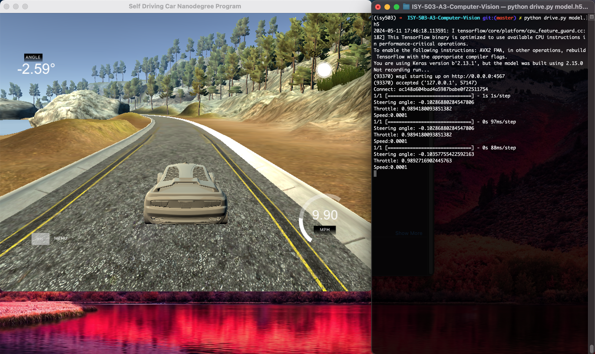

# ISY-503 - Intelligent Systems

Assessment 3 Final Project (Computer Vision) for __ISY-503 - Intelligent Systems__ subject.

## Overview
Tasked of building a machine learning model that is trained on the data provided and when run on Udacity's self-driving car simulator, will hopefully keep the car on the road without running off track. 


## Implementation
The project was divided into two phases: 
### Model implementation
The standalone model was developed in this [Google Colab notebook](https://colab.research.google.com/drive/1Tcw6vkwvnkPCiZ0Fez2rJDkdzIu5oQy5#scrollTo=9QR59YgWRi1P). All the necessary steps were included to develop the model, like:
* Loading of dataset
* Splitting to training, testing, and validation datasets
* Normalisation and preprocessing of dataset
* Model compilation
* Model training
* Model evaluation
* Prediction

In addition, visualisations were included across various stages of the notebook to better illustrate and debug the performance of the model.

The model itself was heavily based on existing articles tackling the _Udacity Self-Driving Car Simulator_ exercises, mainly:
* [naokishibuya/car-behavioral-cloning](https://github.com/naokishibuya/car-behavioral-cloning/tree/master)
* [Self Driving Car using Tensorflow](https://dipankarmedhi.hashnode.dev/self-driving-car-using-tensorflow)

The model was trained using the [dataset](./dataset_sanitised.zip) provided as part of the subject's Assessment 3 resources.

### Integration with simulator
The simulator used for this project was the *Version 1 (12/09/16)* file for [MacOS](https://d17h27t6h515a5.cloudfront.net/topher/2016/November/5831f290_simulator-macos/simulator-macos.zip) taken from the [Udacity self-driving-car-sim](https://github.com/udacity/self-driving-car-sim?tab=readme-ov-file) repository.

Once downloaded, the environment needs to be set up by following the quickstart guided provided in this [repository](https://github.com/naokishibuya/car-behavioral-cloning/tree/master).

With the generated `model.h5` file from the Colab notebook, the `drive.py` script provided by the simulator files is then executed to connect with the simulator. The simulator needs to be run in *Autonomous* mode to test the model with the selected track. This is done by running the command in your terminal:
```
python drive.py model.h5
```

Once connected, the car should start to accelerate.



## Challenges
Some of the challenges encountered were:
* The initial model created yielded decent accuracy and overall performance when trained using the dataset provided. It performed poorly when the model was connected to the simulator.
* Resulted in reworking the model to accommodate its integration to the simulator.
* Setting up of the environment, mostly due to package versions.

## Future Direction
* Train the model using simulator's _Training Mode_ to collect more data than the provided dataset. 
* Test model using other tracks, such as the _Jungle Track_.
